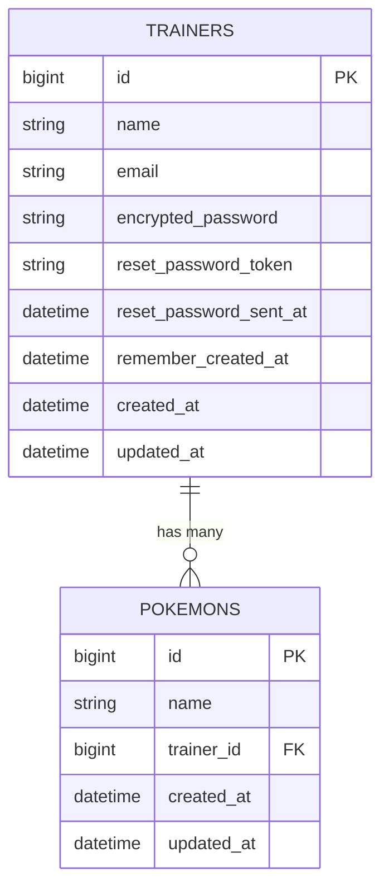

# N+1問題について

「N + 1 問題」について説明してください。<br>
って、企業面接で質問されたら私は嫌です。<br>
なので、勉強しました。<br>

まず、結論から申し上げます。<br>
N + 1問題とはデータベースからデータを取得する際、ループ処理の中でSQLを大量に発行してしまい、パフォーマンスが低下してしまう問題のことです。<br>
解決方法は「includes」メソッドを使って、必要なデータをまとめて取得しましょう。<br>

以上になります。<br>
これだけ覚えて帰ってください。<br>

## どんな時に発生するのか
今回、私は登壇するにあたって、良い題材について探しました。<br>

ずっと悩んでいた結果、N + 1 問題について学ぶことができるゲームがあることに気が付きました。<br>

それは、昔からあるゲームです。<br>


そうですね。ポケットモンスターですね。<br>


今回は、ポケモンに例えて N + 1問題について考えていきます。<br>

N + 1問題は、どのようなケースで発生するのしょうか。<br>
それはテーブルが「１対 多」のアソシエーションの場合に発生します。<br>


例として「ポケモントレーナー」が１に対して、「ポケモン」が多の関係となっているテーブルを用意しました。<br>




トレーナーは、複数のポケモンを所持している。<br>
ポケモンは、１人のトレーナーに属している。という関係です。<br>

ここで、複数のトレーナーのポケモンを全件取得して、一覧表示させてみます。<br>
ポケモンの一覧には、属しているトレーナーの名前も表示します。<br>
このような場合に N + 1 問題が発生します。<br>

## コードを書いてみる。

こんなコードを書いてみました。<br>
```Ruby
pokemons_controller.rb

class PokemonsController < ApplicationController
  def index
    @pokemons = Pokemon.all
  end
end
```

コントローラーのindexアクションです。<br>
Pokemon.all でポケモンを全件取得し、インスタンス変数 @pokemons に代入します。<br>

次に、ビューです。<br>

```html
  <% @pokemons.each do |pokemon| %>
      <%= pokemon.name %>
      <%= pokemon.trainer.name %>
  <% end %>
```
インスタンス変数 @pokemons に格納された全ポケモンをeachでまわします。<br>
ここで注目してほしいのは
```
<%= pokemon.trainer.name %>
```
です。<br>

先ほどのER図の通り、Trainersテーブルは、別のテーブルです。<br>
このコードは、別のテーブルの値であるnameカラムを取得しています。<br>
このコードは一つ一つのpokemonに対して、trainerを取得しています。<br>

情報を整理すると<br>
1. コントローラーに記述の<br>
```Ruby
@pokemons = Pokemon.all
```
でpokemonを全件取得します。<br>
ここで1度目のSQLが発行されます。<br>
```sql
SELECT "pokemons".* FROM "pokemons"
```
例えば、ポケモンを３匹取得したとします。<br>

2. 次に、ビューのeach文中に記述の<br>
```html
<%= pokemon.trainer.name %>
```
で、pokemon１匹につき、１人のtrainerを取得しています。<br>


1番目のpokemonに紐づいているtrainerを取得。<br>
2度目のSQLを発行。<br>
```sql
SELECT "trainers".* FROM "trainers" WHERE "trainers"."id" = 1
```

2番目のpokemonに紐づいているtrainerを取得。<br>
3度目のSQLを発行。<br>
```sql
SELECT "trainers".* FROM "trainers" WHERE "trainers"."id" = 2
```

3番目のpokemonに紐づいているtrainerを取得。<br>
4度目のSQLを発行。<br>
```sql
SELECT "trainers".* FROM "trainers" WHERE "trainers"."id" = 3
```

３匹のポケモンの情報を取得するために、４回のSQLが発行されました。<br>
3 + 1 = 4となりました。<br>
つまり、これが N + 1 問題なのです。<br>
each文でループ処理に入ると、たくさんのSQLが発行されたことが分かります。<br>

## 解決してみる。
RUNTEQのカリキュラムで、N + 1問題の解決方法がありますので、みなさんご存知かと思います。<br>
先程、述べた通り、each文でSQLが大量に発行されました。<br>
なので、each文を発行する前に、pokemonに紐づいているtrainerを全て取得すれば良いのです。<br>

そこで登場するのは includes メソッドです！!<br>

```Ruby
変更前
class PokemonsController < ApplicationController
  def index
    @pokemons = Pokemon.all
  end
end
```

```Ruby
変更後
class PokemonsController < ApplicationController
  def index
    @pokemons = Pokemon.includes(:trainer)
  end
end
```

こうすることにより、コントローラー層で、pokemonを全件取得（１回目のSQL発行）します。<br>
さらに、紐づいているtrainerの情報についても全件取得（２回目のSQL発行）します。<br>
たった２回のSQL発行で済ませることができます。<br>

each文でループに入る前に、まとめて全部取得しているということです。<br>

```sql
１回目のSQL
SELECT "pokemons".* FROM "pokemons"
```
```sql
２回目のSQL
SELECT "trainers".* FROM "trainers" WHERE "trainers"."id" IN (1, 2, 3)
```

## N + 1問題が発生しても気づくことができるのか？

私は、気づくことが出来ないと自信を持って言うことが出来ます！！<br>

ではどうすれば良いのか？<br>
Gemを使いましょう。<br>

今回、紹介するGemは bullet です。<br>

[公式ドキュメント](https://github.com/flyerhzm/bullet)

GemfileにGemを追記します。
```Ruby
group :development do
  gem 'bullet'
end
```

次にbundle install します。
```
docker compose run web bundle install
```

bulletを導入します。
```
docker compose run web rails g bullet:install
```

すると、 N + 1 問題が発生すると、アラートが表示されます。


[詳しくはこちらの記事へ](https://zenn.dev/linkedge/articles/cd1186e196bb9f#bullet%E3%81%A8%E3%81%AF)

## まとめ

1. N+1問題とは、関連データをループ中に都度取得してしまうことで大量のSQLが発行される問題。

2. includes で事前にまとめて取得することで解消できる。

3. Gem bullet を使えば、N + 1問題が発生した時に警告を出してくれる。
